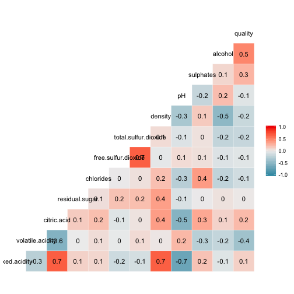

<style type="text/css">
code {     
  font-size: 12px;
}
.eda article p {
  font-size: 14px;
}
</style>

## Introduction

This document serves the purpose of pitching the app [ShinyApplicationAndReproduciblePitch](https://felizardo.shinyapps.io/ShinyApplicationAndReproduciblePitch/). 

In this Shiny app, I am showing the influence of the some wine chemical compounds on the wine quality classification.

The data set can be found in https://www.kaggle.com/sgus1318/winedata. 

** Please be aware that this study serves nothing else as the work for the Course Project. No further conclusion should be taken from this work. **


--- .imp #imp
## Importing data

```r
# Importing data
df = read.csv("https://raw.githubusercontent.com/flyzard/ShinyApplicationAndReproduciblePitch/master/winequality-red.csv")
# Showing the structure of the data
summary(df)
```

```
##  fixed.acidity   volatile.acidity  citric.acid    residual.sugar  
##  Min.   : 4.60   Min.   :0.1200   Min.   :0.000   Min.   : 0.900  
##  1st Qu.: 7.10   1st Qu.:0.3900   1st Qu.:0.090   1st Qu.: 1.900  
##  Median : 7.90   Median :0.5200   Median :0.260   Median : 2.200  
##  Mean   : 8.32   Mean   :0.5278   Mean   :0.271   Mean   : 2.539  
##  3rd Qu.: 9.20   3rd Qu.:0.6400   3rd Qu.:0.420   3rd Qu.: 2.600  
##  Max.   :15.90   Max.   :1.5800   Max.   :1.000   Max.   :15.500  
##    chlorides       free.sulfur.dioxide total.sulfur.dioxide
##  Min.   :0.01200   Min.   : 1.00       Min.   :  6.00      
##  1st Qu.:0.07000   1st Qu.: 7.00       1st Qu.: 22.00      
##  Median :0.07900   Median :14.00       Median : 38.00      
##  Mean   :0.08747   Mean   :15.87       Mean   : 46.47      
##  3rd Qu.:0.09000   3rd Qu.:21.00       3rd Qu.: 62.00      
##  Max.   :0.61100   Max.   :72.00       Max.   :289.00      
##     density             pH          sulphates         alcohol     
##  Min.   :0.9901   Min.   :2.740   Min.   :0.3300   Min.   : 8.40  
##  1st Qu.:0.9956   1st Qu.:3.210   1st Qu.:0.5500   1st Qu.: 9.50  
##  Median :0.9968   Median :3.310   Median :0.6200   Median :10.20  
##  Mean   :0.9967   Mean   :3.311   Mean   :0.6581   Mean   :10.42  
##  3rd Qu.:0.9978   3rd Qu.:3.400   3rd Qu.:0.7300   3rd Qu.:11.10  
##  Max.   :1.0037   Max.   :4.010   Max.   :2.0000   Max.   :14.90  
##     quality     
##  Min.   :3.000  
##  1st Qu.:5.000  
##  Median :6.000  
##  Mean   :5.636  
##  3rd Qu.:6.000  
##  Max.   :8.000
```

--- .eda #eda 
## Exploratory data analysis
As we can see here, the data set has 11 discrete variables and one categorical, the `quality`.
My goal is to find out which variables have more influence on the wine quality and then try to predict the wine quality, playing with quantity of that chemical substances. Let's find the correlation between all the variables.


--- .conclusion #conclusion
## Conclusion
As shown in the plot, the variable with higher correlation with `quality` are `alcohol`, `volatile.acidity`, `sulphates` and `citric.acid`. Im going to train a model on this data set, with a `GLM` algorithm, then use this to predict the quality of a wine with some given propoerties on the Shiny app.

```
model <- train(quality~., df, method ="glm",  
               trControl=trainControl(method = "cv", number = 5, verboseIter = TRUE), na.action = na.exclude)


newdata$alcohol = input$alcohol
        newdata$volatile.acidity = input$volatile.acidity
        newdata$sulphates = input$sulphates
        newdata$citric.acid = input$citric.acid
        
        pred <- predict(model, newdata = newdata)
```
